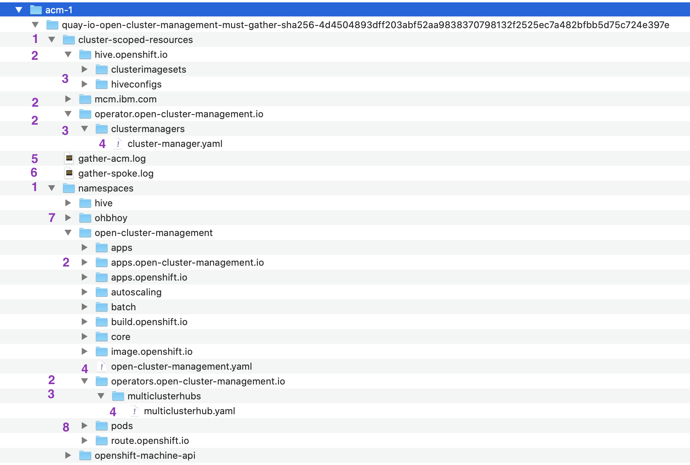
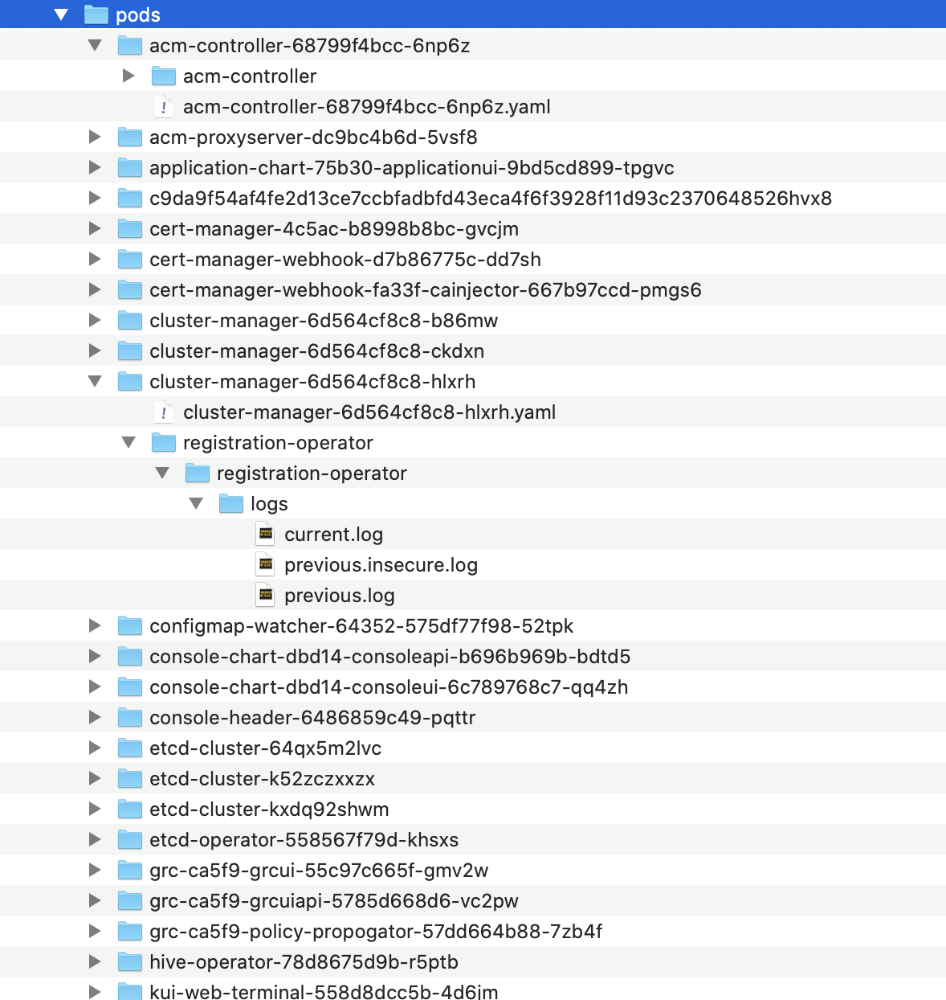

# Must Gather Script for Open Cluster Management

The must gather script for Open Cluster Management allows a user to collect information about various key resources and namespaces that exist on your cluster.

## Usage

```sh
oc adm must-gather --image=quay.io/stolostron/must-gather:SNAPSHOTNAME
```

If you need the results to be saved in a named directory, then following the must-gather instructions, this can be run. Also added are commands to create a gzipped tarball:

```sh
oc adm must-gather --image=quay.io/stolostron/must-gather:SNAPSHOTNAME --dest-dir=SOMENAME ; tar -cvzf SOMENAME.tgz SOMENAME
```

In addition, if we need to collect must-gather for the OpenShift infrastructure, we can run:

```bash
oc adm must-gather
```

## Collecting must-gather for a hosted cluster
If you are having problems creating a hosted cluster, you can use the following command to collect information about the hosted cluster. `hosted-cluster-namespace=HOSTEDCLUSTERNAMESPACE` parameter is optional and if skipped, the hosted cluster is assumed to be in the default namespace which is `clusters`.

```sh
oc adm must-gather --image=quay.io/stolostron/backplane-must-gather:SNAPSHOTNAME /usr/bin/gather hosted-cluster-namespace=HOSTEDCLUSTERNAMESPACE hosted-cluster-name=HOSTEDCLUSTERNAME 
```


If you need the results to be saved in a named directory, you can use the `--dest-dir=SOMENAME` parameter and optionally create a gzipped tarball.

```sh
oc adm must-gather --image=quay.io/stolostron/backplane-must-gather:SNAPSHOTNAME /usr/bin/gather hosted-cluster-namespace=HOSTEDCLUSTERNAMESPACE hosted-cluster-name=HOSTEDCLUSTERNAME --dest-dir=SOMENAME ; tar -cvzf SOMENAME.tgz SOMENAME
```

## Information Captured

1. The above must-gather command can understand where it is being run - Open Cluster Mangement Hub Server or Managed Cluster and collects data accordingly.
2. If run on the Open Cluster Management Hub Server, it will also capture a list of Managed Clusters configured and the status. This is found in the `gather-managed.log` If a Managed Cluster reports a status of not equal to Ready when it is expected to be, then the must-gather command above should be run on the Managed Cluster as well.

### Data collected



Let us go through what is collected:

1. The data is organized under 2 levels - cluster scoped resources and the resources that belong to namespaces (that we have decided to collect)
2. The data is further organized by API group for the custom resource definitions. This is true for both cluster scope and namespace scoped resources.
3. And we can see the Kind for the custom resource defintions.
4. At the leaf level, we can see the `yaml for each of the custom resources for the kind`
5. This log contains the output of `kubectl get pods -n $NAMESPACE-IN-WHICH-OCM-RUNS-ON-HUB`.
6. If run on the Open-Cluster-Management Hub Server, the list of Managed Clusters configured and their status is captured in this log.
7. The list of namespace for each the data is collected. And the output of one namespace is expanded. The other namespaces when expanded will look the same.
8. This is the list of Pods running in each namespace. If a namespace does not contain any pods, this will be not be there.

Data collected for the PODs include:


If we take a look at the cluster-manager POD for example you will see the yaml file which contains detailed output of the POD. You can see the container called registration-operator and its logs.

### Data collected for a hosted cluster

Data from the hosting MCE cluster:

- **Cluster scoped resources**: Nodes definitions of the management cluster.
- **Namespaced resources**: This includes all the objects from all the relevant namespaces, like configmaps, services, events, logs, etc...
- **Network logs**: Includes the OVN northbound and southbound DBs and the statuses for each one.
- **HostedClusters**: Another level of dump, involves all the resources inside of the guest cluster.

Data from the hosted cluster:

- **Cluster scoped resources**: It contains al the cluster-wide objects, things like nodes, CRDs, etc...
- **Namespaced resources**: This includes all the objects from all the relevant namespaces, like configmaps, services, events, logs, etc...

- **hypershift-dump.tar.gz**: A compressed file of all data collected from both hosting and hosted clusters.

**Note:** The hosted cluster data collection does not contain any secret resources from the cluster, only references to the secret's names.

